<h1 align="center">🏪 Store Rating Platform — Full-Stack Store Rating & Review System</h1>

<p align="center">
  A premium, full-stack web application designed to manage and evaluate stores using user ratings. The platform supports three distinct, role-based interfaces for Administrators, Store Owners, and Normal Users. It allows users to browse stores and submit/update ratings, store owners to monitor performance analytics, and administrators to oversee users and stores.
</p>

<p align="center">
  <a href="https://github.com/SurajKarande01/Store-Rating-Model/stargazers"></a>
  <a href="https://github.com/SurajKarande01/Store-Rating-Model/network/members"></a>
  <a href="https://github.com/SurajKarande01/Store-Rating-Model/issues"></a>
</p>

---

## 📌 Table of Contents
1. [Key Features](#-key-features)
2. [Tech Stack & Badges](#-tech-stack--badges)
3. [Architecture & Workflow](#-architecture--workflow)
4. [Project Structure](#-project-structure)
5. [Database Schema](#-database-schema)
6. [Database Setup](#-database-setup)
7. [Backend Setup (Express.js)](#-backend-setup-expressjs)
8. [Frontend Setup (React + Vite)](#-frontend-setup-react--vite)
9. [API Reference](#-api-reference)
10. [Command Sheet](#-command-sheet)
11. [Author](#-author)

---

## ✨ Key Features

- **👥 Multi-Role Authorization & Portals**:
  - **Admin**: Control panel to manage users/store owners (CRUD), add stores, assign stores to owners, and view system-wide metrics.
  - **Normal User**: Browse available stores, submit/update a rating (1-5 stars) for any store, and manage account security.
  - **Store Owner**: Monitoring dashboard featuring store details, list of customer reviews/ratings, and current average rating.
- **🔐 Robust Security & Authentication**:
  - Secure login/signup system powered by **JSON Web Tokens (JWT)** and **bcryptjs** password hashing.
  - Granular role-based authorization middleware protecting API routes.
- **⚡ Modern Responsive UI**:
  - Built with React 18, Vite, and structured Vanilla CSS.
  - Glassmorphic card layouts, responsive navigation bars, interactive hover-states, and custom toast notifications via **React Hot Toast**.
- **⚙️ High-Performance REST API**:
  - Built on Node.js and Express.js with a pooled MySQL database connection (mysql2).
  - Schema-enforced input validations using `express-validator`.
  - Global middleware error handler ensuring smooth failover processes.

---

## 🛠️ Tech Stack & Badges

### 🖥️ Frontend
<p align="left">
  <a href="https://react.dev"></a>
  <a href="https://vite.dev"></a>
  <a href="https://reactrouter.com"></a>
  <a href="https://axios-http.com"></a>
  <a href="https://developer.mozilla.org/en-US/docs/Web/CSS"></a>
</p>

### ⚙️ Backend & Database
<p align="left">
  <a href="https://nodejs.org"></a>
  <a href="https://expressjs.com"></a>
  <a href="https://www.mysql.com"></a>
  <a href="https://jwt.io"></a>
  <a href="https://www.npmjs.com/package/bcryptjs"></a>
  <a href="https://express-validator.github.io/docs"></a>
</p>

---

## 🔗 Architecture & Workflow

The sequence diagram below shows how a Normal User authenticates, loads the store directory, and submits/updates a store rating:

```mermaid
sequenceDiagram
    autonumber
    actor User as User (React UI)
    participant Server as Backend (Express REST API)
    participant DB as Database (MySQL)

    rect rgb(30, 30, 40)
    Note over User,DB: Authentication & Fetching Stores
    User->>Server: POST /api/auth/login (Email & Password)
    Server->>DB: Query user by email
    DB-->>Server: Return user record & password hash
    Server->>Server: Validate password (bcrypt)
    Server-->>User: Return JWT token & User details
    User->>Server: GET /api/stores (Headers: Authorization Bearer JWT)
    Server->>Server: Verify JWT Middleware
    Server->>DB: Fetch stores & user's existing ratings
    DB-->>Server: List of stores + ratings
    Server-->>User: Render dashboard with stores & rating stars
    end

    rect rgb(40, 50, 60)
    Note over User,DB: Submit/Update Store Rating
    User->>User: Select store and click star (1-5)
    User->>Server: POST /api/ratings (Store ID & Rating)
    Server->>Server: Verify JWT & Validate Rating (1-5)
    Server->>DB: Insert or Update rating (ON DUPLICATE KEY UPDATE)
    DB-->>Server: Rating saved successfully
    Server-->>User: Return success message & updated average rating
    end
```



---

## 📁 Project Structure

```text
Store-Rating-Model/
│
├── backend/                      # Node.js & Express.js Backend REST API
│   ├── config/                   # Database configuration
│   │   └── db.js                 # MySQL pool connection setup
│   ├── controllers/              # Route controller handler functions
│   │   ├── adminController.js    # Admin operations (manage users & stores)
│   │   ├── authController.js     # Signup and login business logic
│   │   ├── ratingController.js   # Rating submissions and updates
│   │   ├── storeController.js    # Store browsing query handling
│   │   ├── storeOwnerController.js # Owner dashboard data
│   │   └── userController.js     # User-profile specific actions (e.g., password changes)
│   ├── middleware/               # Request validation & authentication
│   │   ├── auth.js               # JWT verification & role authorization middleware
│   │   └── validators.js         # Input validation rules (express-validator)
│   ├── routes/                   # Router declarations
│   │   ├── admin.js              # Admin endpoints mapping
│   │   ├── auth.js               # Auth endpoints mapping
│   │   ├── ratings.js            # Rating endpoints mapping
│   │   ├── storeOwner.js         # Owner endpoints mapping
│   │   ├── stores.js             # Store endpoints mapping
│   │   └── users.js              # User settings endpoints mapping
│   ├── .env.example              # Template for secret keys & ports
│   ├── package.json              # Backend dependencies & npm scripts
│   ├── schema.sql                # MySQL DB schema script
│   └── server.js                 # Express Application Entry Point
│
├── frontend/                     # React + Vite Frontend Client
│   ├── src/
│   │   ├── api/                  # API network abstraction
│   │   │   └── axios.js          # Axios configuration with interceptors
│   │   ├── components/           # Reusable functional components
│   │   │   ├── Navbar.jsx        # Top navigation bar
│   │   │   ├── ProtectedRoute.jsx # Authentication route guard
│   │   │   └── StarRating.jsx    # Interactive star component
│   │   ├── context/              # React state context providers
│   │   │   └── AuthContext.jsx   # Global login/logout state manager
│   │   ├── pages/                # Page-level route views
│   │   │   ├── AdminAddStore.jsx # Form to add new stores
│   │   │   ├── AdminAddUser.jsx  # Form to register users/owners
│   │   │   ├── AdminDashboard.jsx # Admin metric cards & overview
│   │   │   ├── AdminStores.jsx   # Stores management datagrid
│   │   │   ├── AdminUsers.jsx    # Users management datagrid
│   │   │   ├── ChangePassword.jsx # Profile safety page
│   │   │   ├── Login.jsx         # Sign-in portal page
│   │   │   ├── Signup.jsx        # Sign-up page (Normal Users)
│   │   │   ├── StoreOwnerDashboard.jsx # Owner stats overview
│   │   │   └── UserStores.jsx    # User dashboard for store ratings
│   │   ├── App.jsx               # Routes setup & layout configuration
│   │   ├── index.css             # Main styling sheet
│   │   └── main.jsx              # React mounting file
│   ├── package.json              # Frontend libraries & package scripts
│   └── vite.config.js            # Vite compiler configuration
│
└── README.md                     # Comprehensive Project Documentation
```

---

## 🗄️ Database Schema

The system uses three database tables designed with MySQL constraints and indexed fields to optimize retrieval speed:

1. **`users`**:
   - `id`: INT AUTO_INCREMENT PRIMARY KEY.
   - `name`: VARCHAR(60) NOT NULL.
   - `email`: VARCHAR(255) NOT NULL UNIQUE (indexed).
   - `password_hash`: VARCHAR(255) NOT NULL.
   - `address`: VARCHAR(400).
   - `role`: ENUM('admin', 'user', 'store_owner') NOT NULL DEFAULT 'user' (indexed).
   - `created_at` / `updated_at`: TIMESTAMP fields.
2. **`stores`**:
   - `id`: INT AUTO_INCREMENT PRIMARY KEY.
   - `name`: VARCHAR(60) NOT NULL (indexed).
   - `email`: VARCHAR(255) NOT NULL UNIQUE (indexed).
   - `address`: VARCHAR(400).
   - `owner_id`: INT FOREIGN KEY referencing `users(id)` ON DELETE SET NULL.
3. **`ratings`**:
   - `id`: INT AUTO_INCREMENT PRIMARY KEY.
   - `user_id`: INT FOREIGN KEY referencing `users(id)` ON DELETE CASCADE.
   - `store_id`: INT FOREIGN KEY referencing `stores(id)` ON DELETE CASCADE.
   - `rating`: TINYINT NOT NULL CHECK (values between 1 and 5).
   - `unique_user_store`: UNIQUE constraint on `(user_id, store_id)` ensuring a user can submit only one rating per store.

---

## 🗄️ Database Setup

### 📋 Prerequisites
- **MySQL Server**: v8.x installed and running.

### 🧰 Steps to Initialize
1. Log in to your MySQL terminal and run the schema file. This script automatically creates the database, structures the tables, and seeds a default administrator:
   ```sql
   mysql -u root -p < backend/schema.sql
   ```
2. The seed script registers a default administrator with the following credentials:
   - **Email**: `admin@admin.com`
   - **Password**: `Admin@123`

---

## ⚙️ Backend Setup (Express.js)

### 📋 Prerequisites
- **Node.js**: v18.x or newer installed.
- **npm** (bundled with Node).

### 🧰 Steps to Run
1. Navigate to the backend directory:
   ```bash
   cd backend
   ```
2. Install Node.js packages:
   ```bash
   npm install
   ```
3. Copy the `.env.example` file to create your local `.env` configuration:
   - On Windows (CMD/PowerShell):
     ```powershell
     copy .env.example .env
     ```
   - On macOS/Linux:
     ```bash
     cp .env.example .env
     ```
4. Configure your database details inside `.env`:
   ```env
   PORT=5000
   DB_HOST=localhost
   DB_USER=your_mysql_username
   DB_PASSWORD=your_mysql_password
   DB_NAME=store_rating_db
   JWT_SECRET=your_super_secret_jwt_key
   FRONTEND_URL=http://localhost:3000
   ```
5. Startup the development API server:
   ```bash
   npm run dev
   ```
   > 📍 The Express API server will launch on port **`5000`** (`http://localhost:5000`).

---

## 💻 Frontend Setup (React + Vite)

### 📋 Prerequisites
- **Node.js**: v18.x or newer installed.

### 🧰 Steps to Run
1. Navigate to the frontend directory:
   ```bash
   cd frontend
   ```
2. Install Node.js packages:
   ```bash
   npm install
   ```
3. Startup the development hot-reloading server:
   ```bash
   npm run dev
   ```
   > 📍 The Vite dev server will launch on port **`3000`**. Access it via **`http://localhost:3000`** in your browser.

---

## 🔑 API Reference

### 🧑‍💼 Authentication
| Method | Endpoint | Description | Query/Body params |
| :--- | :--- | :--- | :--- |
| `POST` | `/api/auth/signup` | Register a new normal user account | `name`, `email`, `password`, `address` in body |
| `POST` | `/api/auth/login` | Authenticate credentials & receive JWT token | `email`, `password` in body |

### 👤 User Settings
| Method | Endpoint | Description | Query/Body params |
| :--- | :--- | :--- | :--- |
| `PUT` | `/api/users/password` | Change own password (requires JWT) | `currentPassword`, `newPassword` in body |

### 🏪 Store Rating Portal
| Method | Endpoint | Description | Query/Body params |
| :--- | :--- | :--- | :--- |
| `GET` | `/api/stores` | Fetch all stores with overall average & current user's rating | None |
| `POST` | `/api/ratings` | Submit a rating (1-5) for a store (Normal user only) | `storeId`, `rating` in body |
| `PUT` | `/api/ratings/:id` | Update an existing rating (Normal user only) | `rating` in body |

### 📈 Store Owner Portal
| Method | Endpoint | Description | Query/Body params |
| :--- | :--- | :--- | :--- |
| `GET` | `/api/store-owner/dashboard` | Fetch store stats, rating counts, & comments (Store Owner only) | None |

### 🛠️ Administrator Panel
| Method | Endpoint | Description | Query/Body params |
| :--- | :--- | :--- | :--- |
| `GET` | `/api/admin/dashboard` | Fetch overall application statistics (total ratings, stores, users) | None |
| `GET` | `/api/admin/users` | List all registered users (Normal users, Store owners, Admins) | None |
| `POST` | `/api/admin/users` | Register a new user with any specified role | `name`, `email`, `password`, `address`, `role` in body |
| `GET` | `/api/admin/users/:id` | Get detail record of a user | Path Variable |
| `GET` | `/api/admin/stores` | List all stores alongside their assigned owner names | None |
| `POST` | `/api/admin/stores` | Create a new store and assign owner link | `name`, `email`, `address`, `ownerId` in body |

---

## 🧰 Command Sheet

| Task | Component | Command |
| :--- | :--- | :--- |
| **Install Backend Dependencies** | Backend | `npm install` |
| **Run Backend Dev (Nodemon)** | Backend | `npm run dev` |
| **Run Backend Production** | Backend | `npm start` |
| **Install Frontend Dependencies** | Frontend | `npm install` |
| **Run Frontend Dev (Vite)** | Frontend | `npm run dev` |
| **Build Frontend Static Files** | Frontend | `npm run build` |
| **Initialize Database Schema** | Database | `mysql -u root -p < backend/schema.sql` |

---

## 🧑‍💻 Author

<p align="center">
  <strong>Suraj Karande</strong><br/>
  <a href="https://github.com/SurajKarande01"></a>
  <a href="https://linkedin.com/in/suraj-karande"></a>
</p>
