<h1 align="center">🏪 Store Rating Platform — Full-Stack Store Rating & Review System</h1>

<p align="center">
  A premium, full-stack web application designed to manage and evaluate stores using user ratings. The platform supports three distinct, role-based interfaces for Administrators, Store Owners, and Normal Users. It allows users to browse stores and submit/update ratings, store owners to monitor performance analytics, and administrators to oversee users and stores.
</p>

<p align="center">
  <a href="https://github.com/SurajKarande01/Store-Rating-Model/stargazers"></a>
  <a href="https://github.com/SurajKarande01/Store-Rating-Model/network/members"></a>
  <a href="https://github.com/SurajKarande01/Store-Rating-Model/issues"></a>
</p>

---

## 📌 Table of Contents
1. [Key Features](#-key-features)
2. [Tech Stack & Badges](#-tech-stack--badges)
3. [Architecture & Workflow](#-architecture--workflow)
4. [Project Structure](#-project-structure)
5. [Database Schema](#-database-schema)
6. [Database Setup](#-database-setup)
7. [Backend Setup (Spring Boot)](#-backend-setup-spring-boot)
8. [Frontend Setup (React + Vite + Tailwind)](#-frontend-setup-react--vite--tailwind)
9. [API Reference](#-api-reference)
10. [Command Sheet](#-command-sheet)
11. [Author](#-author)

---

## ✨ Key Features

- **👥 Multi-Role Authorization & Portals**:
  - **Admin**: Control panel to manage users/store owners (CRUD), add stores, assign stores to owners, and view system-wide metrics.
  - **Normal User**: Browse available stores, submit/update ratings (1-5 stars) for stores, and manage account security.
  - **Store Owner**: Monitoring dashboard featuring store details, list of customer ratings, and current overall average rating.
- **🔐 Robust Security & Authentication**:
  - Secure login/signup system powered by **JSON Web Tokens (JWT)** and **Spring Security**.
  - Password hashing via **BCryptPasswordEncoder** and stateless authentication with JWT request filter.
  - Granular role-based authorization rules protecting API routes (`admin`, `store_owner`, `user`).
- **⚡ Modern Responsive UI**:
  - Built with React 18, Vite, and styled with **Tailwind CSS**.
  - Glassmorphic card layouts, responsive navigation bars, interactive hover-states, and custom toast notifications via **React Hot Toast**.
  - Smooth page transitions and animations built using **Framer Motion**.
  - Accessible primitive components powered by **Radix UI** (Avatar, Dialog, Dropdown Menu).
- **⚙️ High-Performance REST API**:
  - Built on **Java 17** and **Spring Boot 3.3.0** with **Spring Data JPA** (Hibernate) for persistence.
  - Automatic MySQL table structure updates via Hibernate DDL config.
  - Input validation using **Spring Boot Starter Validation** annotations (`@Valid`, `@NotBlank`, etc.).
  - Global error handling returning structured error responses.

---

## 🛠️ Tech Stack & Badges

### 🖥️ Frontend
<p align="left">
  <a href="https://react.dev"></a>
  <a href="https://vite.dev"></a>
  <a href="https://tailwindcss.com"></a>
  <a href="https://zustand.docs.pmnd.rs"></a>
  <a href="https://framer.com/motion"></a>
  <a href="https://radix-ui.com"></a>
  <a href="https://lucide.dev"></a>
  <a href="https://reactrouter.com"></a>
  <a href="https://axios-http.com"></a>
</p>

### ⚙️ Backend & Database
<p align="left">
  <a href="https://java.com"></a>
  <a href="https://spring.io/projects/spring-boot"></a>
  <a href="https://spring.io/projects/spring-security"></a>
  <a href="https://spring.io/projects/spring-data-jpa"></a>
  <a href="https://www.mysql.com"></a>
  <a href="https://jwt.io"></a>
  <a href="https://maven.apache.org"></a>
</p>

---

## 🔗 Architecture & Workflow

The sequence diagram below shows how a Normal User authenticates, loads the store directory, and submits/updates a store rating under the Spring Security & Spring Boot backend:

```mermaid
sequenceDiagram
    autonumber
    actor User as User (React UI)
    participant Sec as Spring Security / Filter
    participant Ctrl as Controller (Spring Boot API)
    participant Repo as Repository (Spring Data JPA)
    participant DB as Database (MySQL)

    rect rgb(30, 30, 40)
    Note over User,DB: Authentication & Fetching Stores
    User->>Sec: POST /api/auth/login (Email & Password)
    Sec->>Ctrl: Forward login request
    Ctrl->>Repo: Find User by email
    Repo->>DB: Query user record
    DB-->>Repo: Return User details
    Ctrl->>Ctrl: Authenticate & Generate JWT Token
    Ctrl-->>User: Return JWT token & User details
    end

    rect rgb(40, 50, 60)
    Note over User,DB: Requesting Stores (Protected Route)
    User->>Sec: GET /api/stores (Headers: Authorization Bearer JWT)
    Sec->>Sec: Verify JWT token & check role (ROLE_user)
    Sec->>Ctrl: Forward authenticated request
    Ctrl->>Repo: Fetch stores with overall average & user rating
    Repo->>DB: Execute native query with rating joins
    DB-->>Repo: Return Store Projection records
    Ctrl-->>User: Return stores with user rating and overall rating
    end

    rect rgb(50, 40, 60)
    Note over User,DB: Submit / Update Store Rating
    User->>User: Select store and select rating (1-5 stars)
    User->>Sec: POST /api/ratings (Store ID & Rating) (Headers: Authorization Bearer JWT)
    Sec->>Sec: Verify JWT & role
    Sec->>Ctrl: Forward rating request
    Ctrl->>Repo: Check existing rating or save new Rating
    Repo->>DB: INSERT / UPDATE rating record
    DB-->>Repo: Return saved entity details
    Ctrl-->>User: Return success response
    end
```



---

## 📁 Project Structure

```text
Store-Rating-Model/
│
├── backend/                      # Java Spring Boot Backend API
│   ├── .mvn/                     # Maven Wrapper configuration files
│   ├── src/
│   │   ├── main/
│   │   │   ├── java/com/storerating/api/
│   │   │   │   ├── StoreRatingApplication.java # Spring Boot main entrypoint
│   │   │   │   ├── controller/   # REST Controllers (Auth, Admin, Stores, Ratings, StoreOwner, User, Health)
│   │   │   │   ├── dto/          # Data Transfer Objects for Request/Response payloads
│   │   │   │   ├── entity/       # JPA Entities mapping to MySQL tables
│   │   │   │   ├── exception/    # Global Exception Handler and custom exception mappings
│   │   │   │   ├── repository/   # Spring Data JPA Repository interfaces and SQL projections
│   │   │   │   └── security/     # Spring Security configurations (JWT filter, password encoder, CORS)
│   │   │   └── resources/
│   │   │       └── application.properties # Spring configuration file (DB config, JPA config, JWT secret)
│   │   └── test/                 # Test suites
│   ├── mvnw                      # Maven Wrapper executable (Unix)
│   ├── mvnw.cmd                  # Maven Wrapper executable (Windows)
│   ├── pom.xml                   # Maven project descriptor
│   └── schema.sql                # MySQL DB schema script with seed data
│
├── frontend/                     # React + Vite Frontend Client (styled with Tailwind CSS & Zustand)
│   ├── src/
│   │   ├── api/                  # API communication layer
│   │   │   └── axios.js          # Axios configuration with request interceptors for auth tokens
│   │   ├── components/           # Reusable UI components
│   │   │   ├── Navbar.jsx        # Top navigation bar
│   │   │   ├── ProtectedRoute.jsx # Route authentication guard
│   │   │   └── StarRating.jsx    # Interactive rating star component
│   │   ├── store/                # Zustand State management
│   │   │   └── useAuthStore.js   # Global authentication state store
│   │   ├── pages/                # Page-level route views
│   │   │   ├── AdminAddStore.jsx # Admin form to create new stores
│   │   │   ├── AdminAddUser.jsx  # Admin form to register users/owners
│   │   │   ├── AdminDashboard.jsx # Admin metric overview
│   │   │   ├── AdminStores.jsx   # Admin stores listing & filters
│   │   │   ├── AdminUsers.jsx    # Admin user directory & details
│   │   │   ├── ChangePassword.jsx # User security page
│   │   │   ├── Login.jsx         # Sign-in portal page
│   │   │   ├── Signup.jsx        # Sign-up page (Normal Users)
│   │   │   ├── StoreOwnerDashboard.jsx # Owner stats & rater reviews
│   │   │   └── UserStores.jsx    # User dashboard for store ratings
│   │   ├── App.jsx               # Navigation router configuration
│   │   ├── index.css             # Tailwind CSS imports & custom styles
│   │   └── main.jsx              # React mounting entry point
│   ├── package.json              # Frontend dependencies and npm scripts
│   ├── postcss.config.js         # PostCSS configuration
│   ├── tailwind.config.js        # Tailwind CSS configuration
│   └── vite.config.js            # Vite compiler configuration with API proxy
│
└── README.md                     # Comprehensive Project Documentation
```

---

## 🗄️ Database Schema

The system uses three database tables designed with MySQL constraints and indexed fields to optimize retrieval speed:

1. **`users`**:
   - `id`: INT AUTO_INCREMENT PRIMARY KEY.
   - `name`: VARCHAR(60) NOT NULL.
   - `email`: VARCHAR(255) NOT NULL UNIQUE (indexed).
   - `password_hash`: VARCHAR(255) NOT NULL.
   - `address`: VARCHAR(400).
   - `role`: ENUM('admin', 'user', 'store_owner') NOT NULL DEFAULT 'user' (indexed).
   - `created_at` / `updated_at`: TIMESTAMP fields.
2. **`stores`**:
   - `id`: INT AUTO_INCREMENT PRIMARY KEY.
   - `name`: VARCHAR(60) NOT NULL (indexed).
   - `email`: VARCHAR(255) NOT NULL UNIQUE (indexed).
   - `address`: VARCHAR(400).
   - `owner_id`: INT FOREIGN KEY referencing `users(id)` ON DELETE SET NULL.
3. **`ratings`**:
   - `id`: INT AUTO_INCREMENT PRIMARY KEY.
   - `user_id`: INT FOREIGN KEY referencing `users(id)` ON DELETE CASCADE.
   - `store_id`: INT FOREIGN KEY referencing `stores(id)` ON DELETE CASCADE.
   - `rating`: TINYINT NOT NULL CHECK (values between 1 and 5).
   - `unique_user_store`: UNIQUE constraint on `(user_id, store_id)` ensuring a user can submit only one rating per store.

---

## 🗄️ Database Setup

### 📋 Prerequisites
- **MySQL Server**: v8.x installed and running.

### 🧰 Steps to Initialize
1. Log in to your MySQL terminal and run the schema file. This script automatically creates the database, structures the tables, and seeds a default administrator:
   ```sql
   mysql -u root -p < backend/schema.sql
   ```
2. The seed script registers a default administrator with the following credentials:
   - **Email**: `admin@admin.com`
   - **Password**: `Admin@123`

---

## ⚙️ Backend Setup (Spring Boot)

### 📋 Prerequisites
- **Java Development Kit (JDK)**: Version 17 or newer installed.
- **Maven**: Version 3.6+ (or use the provided Maven Wrapper `mvnw`).

### 🧰 Steps to Run
1. Navigate to the backend directory:
   ```bash
   cd backend
   ```
2. Define the database details in your environment variables or configure them directly inside `src/main/resources/application.properties`:
   ```properties
   DB_HOST=localhost
   DB_NAME=store_rating_db
   DB_USER=your_mysql_username
   DB_PASSWORD=your_mysql_password
   JWT_SECRET=404E635266556A586E3272357538782F413F4428472B4B6250645367566B5970
   ```
3. Startup the development API server using the Maven Wrapper:
   - **Windows**:
     ```powershell
     .\mvnw.cmd spring-boot:run
     ```
   - **macOS/Linux**:
     ```bash
     chmod +x mvnw
     ./mvnw spring-boot:run
     ```
   > 📍 The Spring Boot API server will launch on port **`5000`** (`http://localhost:5000`).

---

## 💻 Frontend Setup (React + Vite + Tailwind)

### 📋 Prerequisites
- **Node.js**: v18.x or newer installed.

### 🧰 Steps to Run
1. Navigate to the frontend directory:
   ```bash
   cd frontend
   ```
2. Install Node.js packages:
   ```bash
   npm install
   ```
3. Startup the development hot-reloading server:
   ```bash
   npm run dev
   ```
   > 📍 The Vite dev server will launch on port **`3000`**. Access it via **`http://localhost:3000`** in your browser. All requests to `/api` will automatically be proxied to the backend at `http://localhost:5000`.

---

## 🔑 API Reference

### 🧑‍💼 Authentication
| Method | Endpoint | Description | Query/Body params |
| :--- | :--- | :--- | :--- |
| `POST` | `/api/auth/signup` | Register a new normal user account | `name`, `email`, `password`, `address` in body |
| `POST` | `/api/auth/login` | Authenticate credentials & receive JWT token | `email`, `password` in body |

### 👤 User Settings
| Method | Endpoint | Description | Query/Body params |
| :--- | :--- | :--- | :--- |
| `PUT` | `/api/users/password` | Change own password (requires JWT) | `currentPassword`, `newPassword` in body |

### 🏪 Store Rating Portal
| Method | Endpoint | Description | Query/Body params |
| :--- | :--- | :--- | :--- |
| `GET` | `/api/stores` | Fetch all stores with overall average & current user's rating | `name`, `address` (optional filters), `sortBy`, `sortOrder` (optional sorting) |
| `POST` | `/api/ratings` | Submit a rating (1-5) for a store (Normal user only) | `storeId`, `rating` in body |
| `PUT` | `/api/ratings/:id` | Update an existing rating (Normal user only) | `rating` in body |

### 📈 Store Owner Portal
| Method | Endpoint | Description | Query/Body params |
| :--- | :--- | :--- | :--- |
| `GET` | `/api/store-owner/dashboard` | Fetch store stats, rating counts, & comments (Store Owner only) | None |

### 🛠️ Administrator Panel
| Method | Endpoint | Description | Query/Body params |
| :--- | :--- | :--- | :--- |
| `GET` | `/api/admin/dashboard` | Fetch overall application statistics (total ratings, stores, users) | None |
| `GET` | `/api/admin/users` | List all registered users (Normal users, Store owners, Admins) | `name`, `email`, `address`, `role`, `sortBy`, `sortOrder` (optional filters) |
| `POST` | `/api/admin/users` | Register a new user with any specified role | `name`, `email`, `password`, `address`, `role` in body |
| `GET` | `/api/admin/users/:id` | Get detail record of a user (including owned stores if owner) | Path Variable |
| `GET` | `/api/admin/stores` | List all stores alongside their assigned owner names | `name`, `email`, `address`, `sortBy`, `sortOrder` (optional filters) |
| `POST` | `/api/admin/stores` | Create a new store and assign owner link | `name`, `email`, `address`, `ownerId` in body |

---

## 🧰 Command Sheet

| Task | Component | Command |
| :--- | :--- | :--- |
| **Run Backend Dev (Spring Boot)** | Backend | Windows: `.\mvnw.cmd spring-boot:run` <br> Unix: `./mvnw spring-boot:run` |
| **Build Backend Production Jar** | Backend | `mvnw clean package` |
| **Install Frontend Dependencies** | Frontend | `npm install` |
| **Run Frontend Dev (Vite)** | Frontend | `npm run dev` |
| **Build Frontend Static Files** | Frontend | `npm run build` |
| **Initialize Database Schema** | Database | `mysql -u root -p < backend/schema.sql` |

---

## 🧑‍💻 Author

<p align="center">
  <strong>Suraj Karande</strong><br/>
  <a href="https://github.com/SurajKarande01"></a>
  <a href="https://linkedin.com/in/suraj-karande"></a>
</p>
